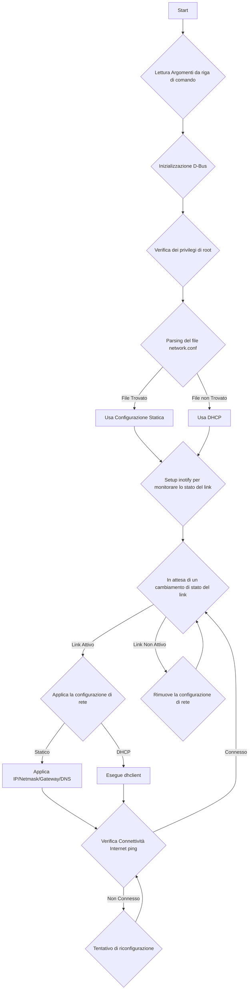

# networkManager

`networkManager` is a C application for managing a network interface on a Linux system. It monitors the link status of a specified network device and automatically configures it using either a static IP configuration or DHCP.

## Funzionalità

- **Monitoraggio dello Stato del Link**: Utilizza `inotify` per monitorare in tempo reale lo stato del link di rete (connesso/disconnesso).
- **Configurazione Automatica**:
  - **Statica**: Se viene trovato un file `network.conf`, il programma applica la configurazione di rete statica specificata (indirizzo IP, netmask, gateway, DNS).
  - **DHCP**: In assenza del file `network.conf`, il programma utilizza `dhclient` per ottenere una configurazione di rete dinamica.
- **Verifica della Connettività**: Esegue un ping verso un server pubblico (es. 8.8.8.8) per verificare la connettività a Internet.
- **Riconfigurazione Automatica**: Se la verifica della connettività fallisce, il programma tenta di riconfigurare la rete.
- **Logging**: Fornisce un sistema di logging per monitorare le operazioni del programma.
- **D-Bus**: Si integra con D-Bus per la comunicazione inter-processo.

## Diagramma di Flusso



## Build

Per compilare il progetto, assicurarsi di avere `gcc`, `make` e `pkg-config` installati. Inoltre, è necessaria la libreria di sviluppo di `dbus-1`.

Su sistemi basati su Debian/Ubuntu, è possibile installare le dipendenze con il seguente comando:

```bash
sudo apt-get update
sudo apt-get install build-essential pkg-config libdbus-1-dev
```

Una volta installate le dipendenze, compilare il progetto con:

```bash
make
```

## Utilizzo

Eseguire il `networkManager` con privilegi di root:

```bash
sudo ./networkManager [opzioni]
```

### Opzioni

- `-d, --device <nome_device>`: Specifica il nome dell'interfaccia di rete da gestire (es. `eth0`). Default: `eth0`.
- `-c, --config <file_config>`: Specifica il percorso del file di configurazione di rete. Default: `network.conf`.
- `-D, --debug <livello>`: Imposta il livello di debug (0-3). Default: 1 (INFO).

### Esempio

```bash
# Esegue il network manager sul device enp3s0 con un file di configurazione custom
sudo ./networkManager --device enp3s0 --config /etc/custom_network.conf
```
